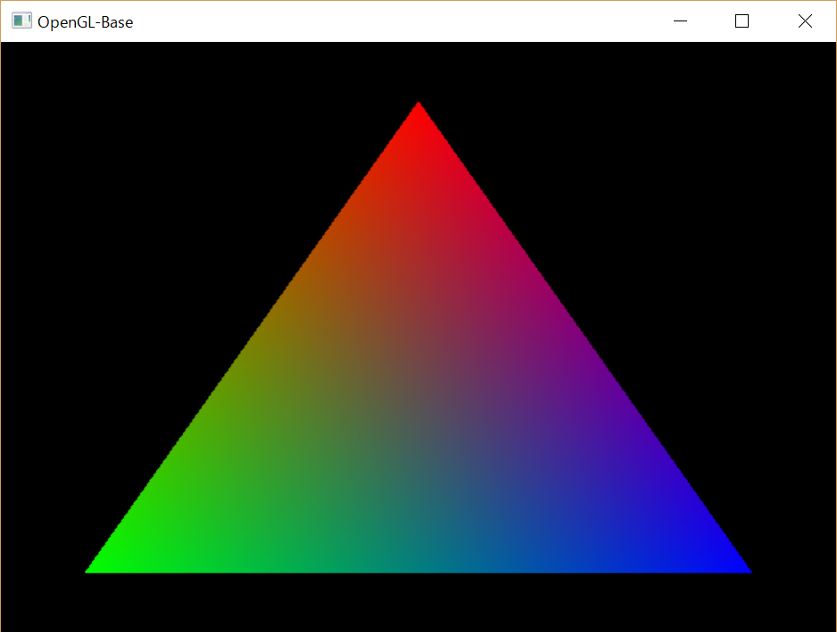

opengl-base: Simply draw a colorful triangle
====

This program draws a colorful triangle. This source codes are expected to be
used for the template to create a new OpenGL sample program in this project.

